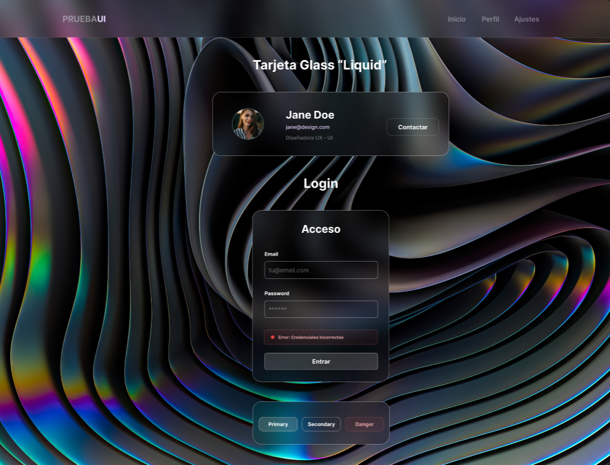

# 💎 Glassmorphism UI Kit



> Una implementación moderna de interfaz de usuario basada en la estética **Glassmorphism**, desarrollada con **React** y estilada meticulosamente con **Tailwind CSS**.

---

## 📋 Sobre el Proyecto

Esta práctica se centra en el estilado avanzado de componentes reutilizables, priorizando la arquitectura CSS, la coherencia visual y el diseño responsivo. Se ha prescindido de archivos CSS tradicionales en favor de un sistema de diseño basado en variables de configuración de Tailwind.

### 🚀 Tecnologías


---

## ✨ Características Principales

* **🎨 Estética Glassmorphism:** Uso intensivo de `backdrop-blur`, transparencias `bg-black/20` y bordes sutiles para crear profundidad y jerarquía.
* **📱 Diseño Responsive:** Todos los componentes se adaptan fluidamente de móvil a escritorio.
* **🔧 Design System Integrado:** Colores, sombras y radios definidos en `tailwind.config.js` basados en tokens de Figma.
* **⚡ Componentes Interactivos:** Estados `hover`, `focus` y `disabled` con transiciones suaves (`duration-300`).
* **🧩 Gestión de Clases:** Uso de la librería `clsx` para manejar variantes de componentes de forma limpia.

---

## 🧱 Componentes Desarrollados

### 1. LoginForm
Un formulario de acceso flotante con validación visual.
* **Detalles:** Inputs con estados de foco accesibles, mensaje de error visual animado y fondo semitransparente.
* **Variable Clave:** `bg-bg-black-20` para asegurar legibilidad sobre fondos complejos.

### 2. UserCard
Tarjeta de presentación de perfil adaptable.
* **Responsive:** Diseño en columna para móvil y fila para escritorio.
* **Estilo:** Avatar con borde brillante y sombra suave difuminada.

### 3. Navbar
Barra de navegación fija con efecto de cristal esmerilado.
* **Funcionalidad:** Menú hamburguesa funcional para dispositivos móviles.
* **Branding:** Logo con doble tono (Gris + Acento UI).

### 4. Botones Reutilizables
Componente base flexible con variantes gestionadas por `clsx`.
* **Variantes:** `Primary`, `Secondary` (Glass), `Danger`.

---

## 🎨 Sistema de Diseño (Design Tokens)

Se ha realizado ingeniería inversa desde un prototipo de Figma para configurar Tailwind con variables semánticas.

## 🛠️ Instalación y Uso

1.  **Clonar el repositorio:**
    ```bash
    git clone [https://github.com/xni0/glass-dashboard.git](https://github.com/xni0/glass-dashboard.git)
    ```

2.  **Instalar dependencias:**
    ```bash
    npm install
    ```

3.  **Ejecutar servidor de desarrollo:**
    ```bash
    npm run dev
    ```

---

## 🔗 Enlaces
* [🎨 Ver Prototipo en Figma](https://www.figma.com/design/GMjXNu2ZHCf2OwtfhcL4zY/Componentes-Glassmorphism?node-id=0-1&t=8YvWL2WSNw9kkaWK-1)
